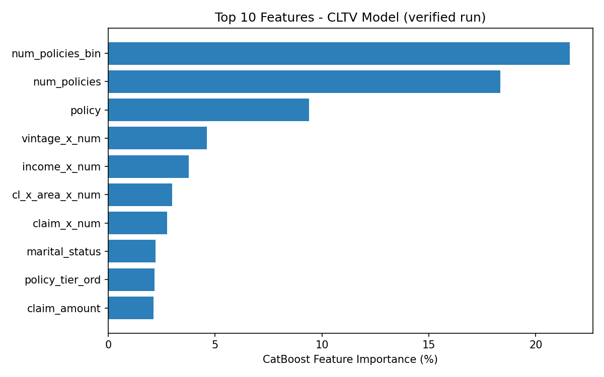

# VahanBima CLTV Prediction

Predicting Customer Lifetime Value (CLTV) for a motor-insurance provider, so
customers can be segmented into service tiers (dedicated claim handlers,
doorstep service, etc.).

CatBoost regression model with engineered features, multi-seed cross-validation,
and ensemble averaging. All numbers below are from an actual end-to-end run of
`cltv_model.py` on the full dataset — not placeholders.

## Results

| Metric | Value |
|---|---|
| OOF R² (5-fold CV, 3-seed average) | **0.1608** |
| OOF RMSE | **$83,010** |
| OOF MAE | **$50,424** |
| Train rows / Test rows | 89,392 / 59,595 |
| Engineered features | 35 (from 10 raw columns) |

**Read this honestly:** an R² of 0.16 means the model explains about 16% of
the variance in CLTV — it is *directional*, useful for ranking customers into
relative tiers, but far from a precise dollar-value predictor. See
[Limitations](#limitations--honest-assessment) below for why, and what would
likely move this number.

### Feature importance (top 10)



| Rank | Feature | Importance (%) |
|---|---|---|
| 1 | `num_policies_bin` (has >1 policy) | 21.6 |
| 2 | `num_policies` (raw category) | 18.3 |
| 3 | `policy` (policy product A/B/C) | 9.4 |
| 4 | `vintage_x_num` (tenure × multi-policy) | 4.6 |
| 5 | `income_x_num` (income × multi-policy) | 3.8 |
| 6 | `cl_x_area_x_num` (claim × urban × multi-policy) | 3.0 |
| 7 | `claim_x_num` (claim × multi-policy) | 2.8 |
| 8 | `marital_status` | 2.2 |
| 9 | `policy_tier_ord` (Silver/Gold/Platinum) | 2.2 |
| 10 | `claim_amount` (raw) | 2.1 |

Full list: [`results/feature_importance.csv`](results/feature_importance.csv).

Whether a customer holds more than one policy is by far the strongest signal —
`num_policies_bin` and `num_policies` together account for ~40% of the
model's total importance. Most of the engineered interaction features are
built around this variable for that reason.

## Problem statement

VahanBima is a motor-vehicle insurer. It wants to launch personalized service
programs (dedicated claim handlers, doorstep services) for its higher-value
customers, and needs to segment customers into value tiers based on predicted
CLTV in order to decide who gets which tier of service.

## Dataset

10 raw features per customer, verified from the shipped files:

| Column | Type | Values |
|---|---|---|
| `gender` | categorical | Male, Female |
| `area` | categorical | Urban, Rural |
| `qualification` | categorical | Bachelor, High School, Others |
| `income` | categorical (ordinal) | <=2L, 2L-5L, 5L-10L, More than 10L |
| `marital_status` | numeric (0/1) | |
| `vintage` | numeric | years with the company |
| `claim_amount` | numeric | total claims filed |
| `num_policies` | categorical | 1, More than 1 |
| `policy` | categorical | A, B, C |
| `type_of_policy` | categorical (ordinal) | Silver, Gold, Platinum |

Target: `cltv` — continuous, right-skewed, no missing values in either file
(verified via `isnull().sum()`).

| | Train (n=89,392) |
|---|---|
| Mean | $97,953 |
| Std | $90,614 |
| Min | $24,828 |
| Max | $724,068 |

Full-size files are **not committed to this repo** — see
[Getting the data](#getting-the-data). A 200-row sample of each is committed
under `data/sample/` so the pipeline can be smoke-tested without them.

## Approach

```
Raw data (10 features)
    → Feature engineering (35 features: ordinal encodings, binary flags,
       log transform, pairwise + 3-way interactions, ratios, polynomials)
    → 5-fold CV × 3 seeds (finds optimal boosting-iteration count per seed)
    → Train 3 final models on 100% of training data at the calibrated
       iteration counts
    → Average the 3 models' predictions
```

**Why CatBoost:** 7 of the 10 raw columns are categorical. CatBoost encodes
them natively via Ordered Target Statistics — a built-in, leak-free target
encoding — removing the need for manual label/frequency/target encoding.

**Why 3-seed CV + full-data retrain instead of a single 80/20 split:**
early stopping needs a held-out validation set to know when to stop, but the
final model is trained on 100% of the data (no rows withheld) using an
iteration count calibrated from CV. Averaging 3 differently-seeded models
further reduces prediction variance.

Verified calibrated iteration counts from this run: `{42: 167, 7: 252, 13: 195}`.

> A note on a claim in an earlier draft of this project: CatBoost was said to
> have "outperformed XGBoost and LightGBM" on this dataset, with specific R²
> numbers (0.1607 CatBoost vs 0.1588 XGBoost) in the script's own comments.
> That comparison was **not re-run or independently verified** as part of
> producing the numbers in this README — treat it as the original author's
> note, not a benchmarked result, unless you rerun it yourself.

## Repo structure

```
.
├── README.md
├── cltv_model.py              # main pipeline (CLI, see Usage below)
├── requirements.txt
├── .gitignore
├── data/
│   └── sample/
│       ├── train_sample.csv   # first 200 rows of the real training data
│       └── test_sample.csv    # first 200 rows of the real test data
└── results/
    ├── metrics.json           # verified OOF R²/RMSE/MAE from the run above
    ├── feature_importance.csv # full 35-feature importance ranking
    ├── feature_importance.png
    └── sample_predictions.csv # first 20 rows of actual model output
```

## Setup

```bash
git clone https://github.com/Gaya3Bhat/vahanbima-cltv-prediction.git
cd vahanbima-cltv-prediction
pip install -r requirements.txt
```

## Getting the data

The full train/test files aren't committed (train alone is ~5MB as .xlsx,
and committing raw competition data to a public repo isn't great practice).
Place your copies at:

```
data/CLTV_TRAINDATA.xlsx   # 89,392 rows
data/CLTV_TESTDATA.csv     # 59,595 rows
```

## Usage

Full run (needs the full-size files above):

```bash
python cltv_model.py \
    --train data/CLTV_TRAINDATA.xlsx \
    --test  data/CLTV_TESTDATA.csv \
    --out   submission.csv
```

This reproduces the metrics reported above and writes `results/metrics.json`
and `results/feature_importance.csv`.

Quick smoke test on the committed 200-row samples (reduced folds/iterations —
**not representative of the real metrics**, just checks the code runs):

```bash
python cltv_model.py \
    --train data/sample/train_sample.csv \
    --test  data/sample/test_sample.csv \
    --out   submission_sample.csv \
    --quick
```

## Limitations & honest assessment

- **R² of 0.16 is modest.** The 10 raw features here are mostly static
  demographic/policy attributes — there's no behavioral or interaction data
  (browsing, claim frequency over time, communication history, etc.), which
  is normally where a lot of CLTV signal lives. A model built only on
  demographics + policy snapshot is capped by how much of `cltv`'s variance
  those attributes actually explain.
- **`has_claim` and raw `income`/`qualification` contribute almost nothing**
  (<0.5% importance each) — they're candidates to drop in a future pass to
  simplify the feature set without hurting R².
- **The "techniques tested & rejected" comparisons in `cltv_model.py`**
  (frequency encoding, OOF target encoding, XGBoost blending, deeper trees)
  are inherited from the original author's experiments and were not rerun
  as part of verifying this README — they're documented as-is, not
  re-benchmarked.
- No confidence intervals or prediction uncertainty are produced — every
  `cltv` prediction is a point estimate.

### What would likely move R² further

- Behavioral/interaction features (claim recency, service-contact frequency)
  if such data becomes available.
- Quantile or distributional regression, given the heavy right skew of
  `cltv`, instead of point-estimate RMSE optimization.
- A residual analysis by segment (income bracket, area) to check whether
  error is concentrated somewhere specific rather than uniform.

## License

No license file is included in this repo. All rights reserved by default —
add a LICENSE file if you want to permit reuse.
